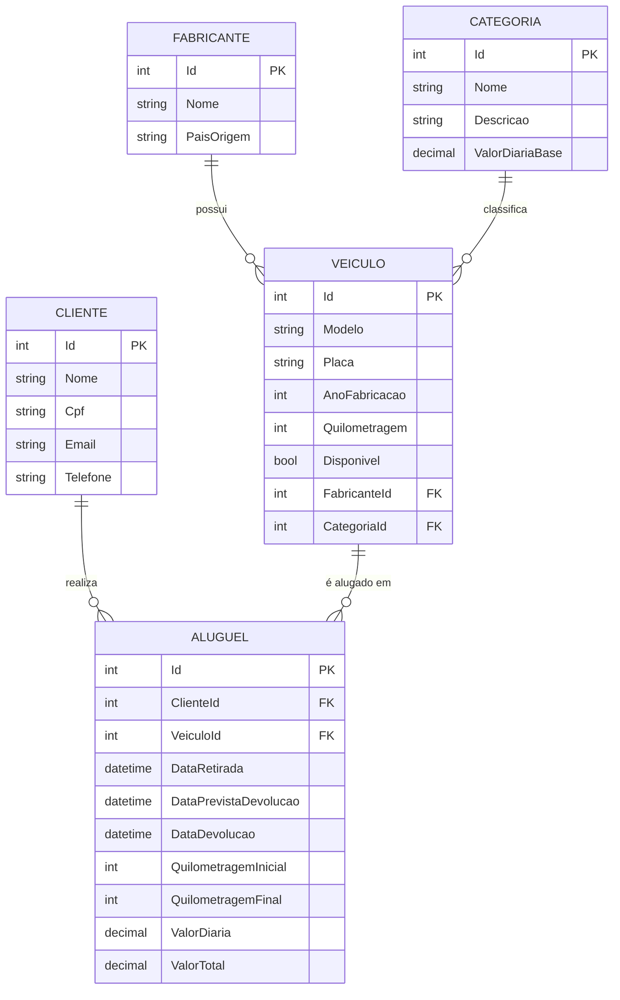

# Locadora de Veículos – TP1

Sistema de aluguel de veículos com C#, ASP.NET Core, Entity Framework Core, SQL Server Express e Swagger.

## Etapa 1 – Modelagem do banco de dados

### Modelo conceitual (entidades e relacionamentos)



### Estrutura

- `Models/` – classes de entidade (Fabricante, Categoria, Veiculo, Cliente, Aluguel)
- `Data/ApplicationContext.cs` – DbContext com mapeamento (Fluent API): chaves primárias, estrangeiras, índices únicos e CHECK constraints
- `appsettings.json` – connection string do SQL Server Express

### Como executar

Pré-requisitos: .NET SDK 10, SQL Server Express e a ferramenta `dotnet-ef`:

```bash
dotnet tool install --global dotnet-ef
```

Criar o banco a partir do modelo:

```bash
dotnet restore
dotnet ef migrations add InitialCreate
dotnet ef database update
```

Se a instância do SQL Express tiver outro nome, ajuste `ConnectionStrings:DefaultConnection` no `appsettings.json`.

### Criando as tabelas no SQL Express

O esquema físico é gerado pelo próprio Entity Framework a partir das classes
de `Models/` e do mapeamento de `Data/ApplicationContext.cs` (abordagem Code First):

```bash
dotnet ef migrations add InitialCreate   # gera a pasta Migrations/ com o esquema
dotnet ef database update                # cria o banco e as tabelas no SQL Express
```

Depois do `database update`, as tabelas `Fabricantes`, `Categorias`, `Veiculos`,
`Clientes` e `Alugueis` estarão criadas no banco `LocadoraVeiculosDb`.

Para conferir o SQL que o EF vai executar, sem aplicar nada:

```bash
dotnet ef migrations script
```


