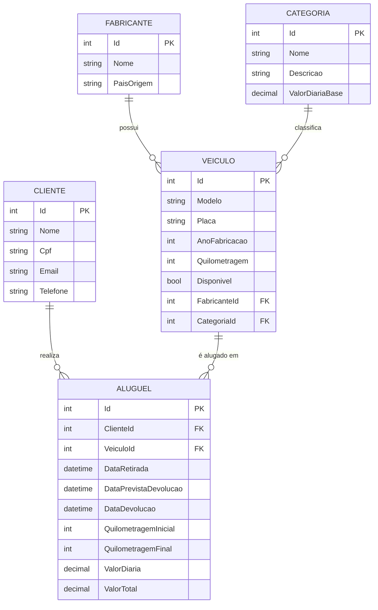

# Locadora de Veículos – TP1

Sistema de aluguel de veículos com C#, ASP.NET Core, Entity Framework Core, SQL Server Express e Swagger.

## Etapa 1 – Modelagem do banco de dados

### Modelo conceitual (entidades e relacionamentos)



### Estrutura

- `Models/` – classes de entidade (Fabricante, Categoria, Veiculo, Cliente, Aluguel)
- `Data/ApplicationContext.cs` – DbContext com mapeamento (Fluent API): chaves primárias, estrangeiras, índices únicos e CHECK constraints
- `appsettings.json` – connection string do SQL Server Express

### Como executar

Pré-requisitos: .NET SDK 10, SQL Server Express e a ferramenta `dotnet-ef`:

```bash
dotnet tool install --global dotnet-ef
```

Criar o banco a partir do modelo:

```bash
dotnet restore
dotnet ef migrations add InitialCreate
dotnet ef database update
```

Se a instância do SQL Express tiver outro nome, ajuste `ConnectionStrings:DefaultConnection` no `appsettings.json`.

### Criando as tabelas no SQL Express

O esquema físico é gerado pelo próprio Entity Framework a partir das classes
de `Models/` e do mapeamento de `Data/ApplicationContext.cs` (abordagem Code First):

```bash
dotnet ef migrations add InitialCreate   # gera a pasta Migrations/ com o esquema
dotnet ef database update                # cria o banco e as tabelas no SQL Express
```

Depois do `database update`, as tabelas `Fabricantes`, `Categorias`, `Veiculos`,
`Clientes` e `Alugueis` estarão criadas no banco `LocadoraVeiculosDb`.

Para conferir o SQL que o EF vai executar, sem aplicar nada:

```bash
dotnet ef migrations script
```


## Etapa 2 – Implementação do Backend

Backend em ASP.NET Core com APIs RESTful, acessando o SQL Server Express através do
Entity Framework Core (`ApplicationContext` injetado nos controllers).

### Endpoints CRUD

Cada uma das 5 entidades possui os cinco endpoints abaixo (`{entidade}` =
`fabricantes`, `categorias`, `clientes`, `veiculos` ou `alugueis`):

| Método | Rota | Descrição | Respostas |
|---|---|---|---|
| GET | `/api/{entidade}` | Lista todos os registros | 200 |
| GET | `/api/{entidade}/{id}` | Busca um registro pelo id | 200, 404 |
| POST | `/api/{entidade}` | Cria um registro | 201, 400 |
| PUT | `/api/{entidade}/{id}` | Atualiza um registro | 200, 400, 404 |
| DELETE | `/api/{entidade}/{id}` | Remove um registro | 204, 400, 404 |

### Validação e tratamento de erros

- **Data Annotations** nas entidades (`[Required]`, `[StringLength]`, `[Range]`,
  `[EmailAddress]`, `[RegularExpression]` para o CPF). Com `[ApiController]`, dados
  inválidos retornam automaticamente **400 Bad Request** detalhando cada campo.
- **Regras de negócio** verificadas nos controllers: nome/CPF/e-mail/placa duplicados,
  existência das chaves estrangeiras, data de devolução anterior à retirada e
  quilometragem final menor que a inicial.
- **Integridade referencial**: exclusão bloqueada (400) quando existem registros filhos.
- **Exceções**: `DbUpdateException` tratada nas operações de escrita e um
  `UseExceptionHandler` global que devolve 500 em JSON para erros inesperados.

### Filtros (item 2.5) – 5 rotas com dois tipos de join

| # | Rota | Join |
|---|---|---|
| 1 | `GET /api/filtros/veiculos-por-fabricante?fabricante=` | INNER JOIN (Veiculo + Fabricante + Categoria) |
| 2 | `GET /api/filtros/alugueis-por-periodo?inicio=&fim=` | INNER JOIN (Aluguel + Cliente + Veiculo) |
| 3 | `GET /api/filtros/fabricantes-com-veiculos?pais=` | LEFT JOIN (Fabricante + Veiculo) |
| 4 | `GET /api/filtros/clientes-com-alugueis?nome=` | LEFT JOIN (Cliente + Aluguel) |
| 5 | `GET /api/filtros/veiculos-disponiveis-por-categoria?categoria=&valorMaximoDiaria=` | INNER JOIN (Veiculo + Categoria + Fabricante) |

Os filtros 3 e 4 usam `GroupJoin` com `DefaultIfEmpty()`, o que gera LEFT JOIN no SQL:
fabricantes sem veículos e clientes sem aluguéis também aparecem no resultado.

### Executando a API

```bash
dotnet run
```

A interface do Swagger fica disponível em `https://localhost:<porta>/swagger`.

## Etapa 3 – Testes e Documentação

- **Swagger (item 3.1)**: integrado ao projeto e disponível em `/swagger` ao executar
  `dotnet run`. A configuração usa os comentários `/// <summary>` dos controllers como
  descrição de cada endpoint.
- **Documentação das APIs (item 3.2)**: [`docs/Documentacao-APIs.md`](docs/Documentacao-APIs.md)
  — métodos HTTP, parâmetros e códigos de resposta de todos os endpoints.
- **Relatório de testes (item 3.3)**: [`docs/Relatorio-de-Testes.md`](docs/Relatorio-de-Testes.md)
  — chamada e retorno de cada método da API, evidenciados por prints de tela
  (imagens em `docs/imagens/`).
